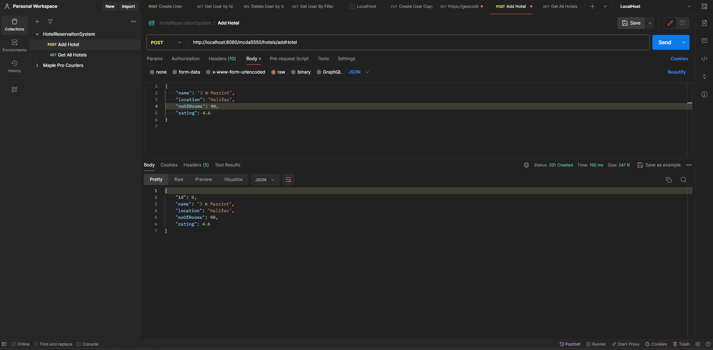
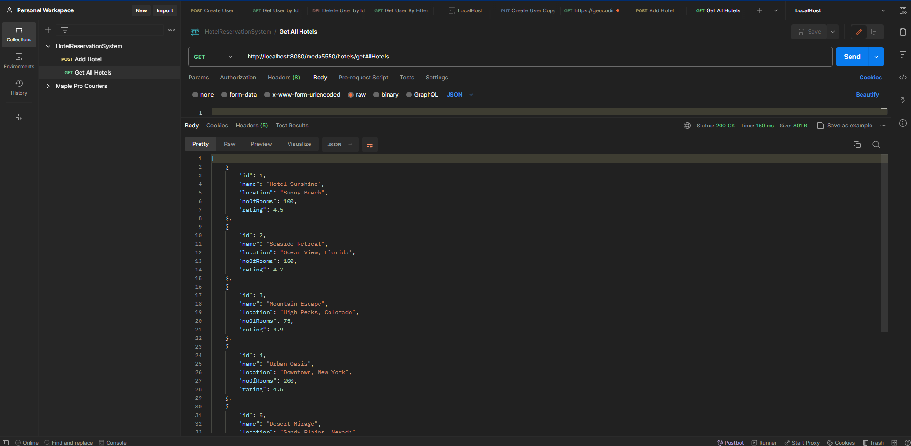

# Hotel Reservation System

## Prerequisites

Before you begin, ensure you have met the following requirements:

- **Java JDK 21**: Make sure Java Development Kit (JDK) 21 is installed on your system. You can download it from the [official Oracle website](https://www.oracle.com/java/technologies/javase/jdk21-archive-downloads.html) or through any OpenJDK version that matches JDK 21 features.
- **IDE for Spring Development**: You need an Integrated Development Environment (IDE) like IntelliJ IDEA, Eclipse, or Spring Tool Suite (STS) that supports Spring development.
- **Maven 3.9.6**: Apache Maven is used for project management and build. Ensure Maven 3.9.6 is installed. You can download it from the [Apache Maven Project website](https://maven.apache.org/download.cgi).

This project is built using Java JDK 21 and Maven 3.9.6.

## API Endpoints

The Hotel Reservation System provides the following endpoints:

### Add a New Hotel
The Spring Boot Application is currently deployed on AWS elastic beanstack and can be accessed via below apis:

### Get List of all Hotels

To get list of all hotels from the system, use the following `curl` command:


```bash
curl --location 'http://hotel-reservation-env.eba-ihpnu2st.us-east-1.elasticbeanstalk.com/mcda5550/hotels/getAvailableHotels?checkIn=2024-04-01&checkOut=2024-04-05&numberOfRoomsRequired=3' \
--header 'Accept: application/json'
```

#### Create a new Booking 

````bash
curl --location 'http://hotel-reservation-env.eba-ihpnu2st.us-east-1.elasticbeanstalk.com/mcda5550/hotels/createBooking' \
--header 'Content-Type: application/json' \
--header 'Accept: application/json' \
--data-raw '{
    "hotel": {
        "id": 2
    },
    "checkIn": "2024-06-20",
    "checkOut": "2024-06-25",
    "email": "guest@example.com",
    "numberOfRooms": 2,
    "guestsList": [
        {
            "guestName": "Alice Johnson",
            "gender": "Female"
        },
        {
            "guestName": "Bob Smith",
            "gender": "Male"
        }
    ]
}
'
````
Note: Above curls assume that the application is up loacally on port 8080. Please update the port number in URL as per scenario.

### Image of successfull postman execution of Post Command


### Image of successfull postman execution of Get Command

